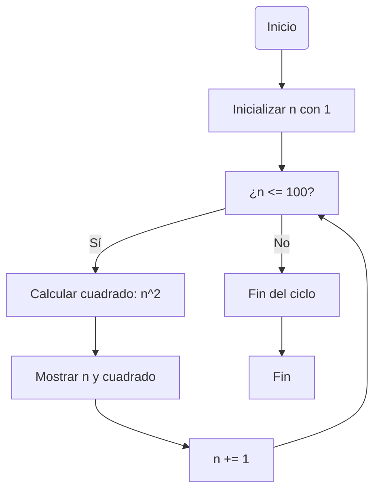
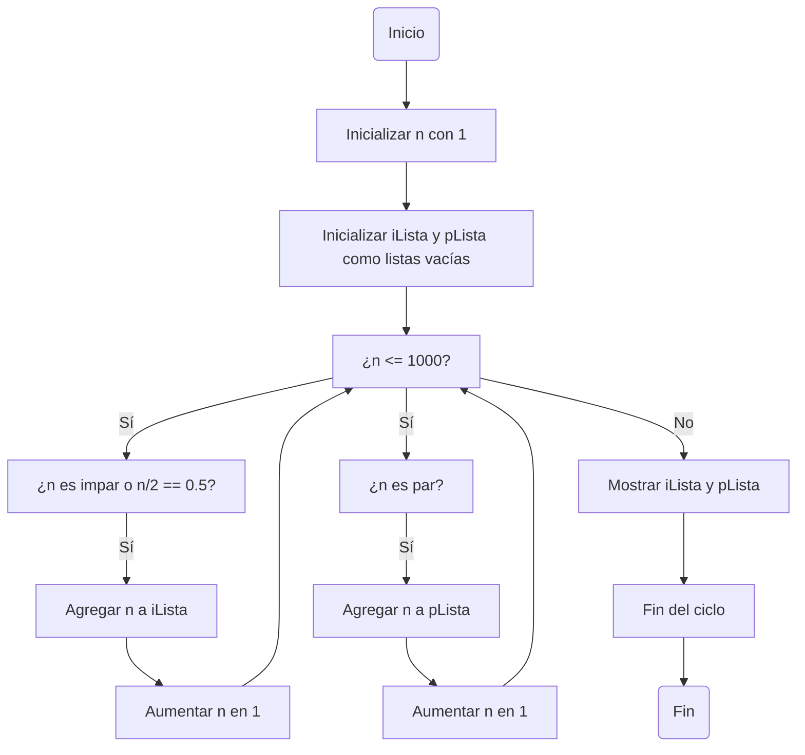
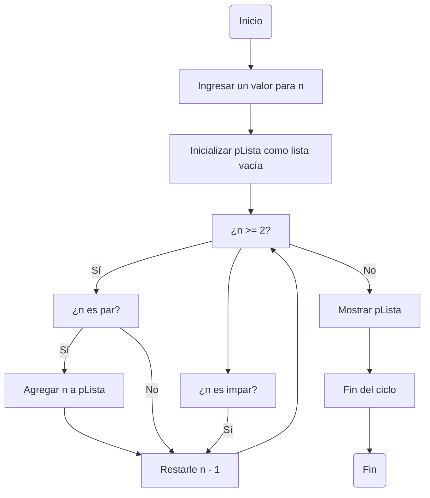

# Reto7-QUE-RETO-TAN-LARGO...
### Problemas de este reto
---
#### 1. Imprimir un listado con los números del 1 al 100 cada uno con su respectivo cuadrado.
##### Solución:
La documentación del código estará en el mismo código
##### Código:
```
n : int = 1 #Declaramos e inicializamos la variable
while n <= 100: #Aplicamos iteración
    cuadrado = n**2 #aplicamos num al cuadrado
    print (n, cuadrado, sep=", ") #Imprimimos el num, el cuadrado del num y los separamos con sep=
    n += 1 #Actualizamos +1 para que se evaluen los demás enteros posibles
print("Fin del ciclo") #Si la respuesta booleana de la iteración no es verdadera se acaba el ciclo e imprime 'fin de ciclo'
```
##### El diagrama de flujo sería el siguiente:

#### 2. Imprimir un listado con los números impares desde 1 hasta 999 y seguidamente otro listado con los números pares desde 2 hasta 1000.
##### Solución:
La documentación del código estará en el mismo código
##### Código:
```
n: int= 1 #Declaramos es Inicializamos la variable 'n'
iLista = [] #Creamos las listas, una para los impares y otra para los pares
pLista = []
while (n <= 1000): #Añadimos la iteración que funcionará si 'n' es menor o igual a 1000
    if (n % 2 == 1) or (n/2 == 0.5): #Usamos if para que cada vez que 'n' % 2 nos de 1 sepamos que es impar, hay una excepción y es con el 1, por eso la añadimos con el 'or'. Si n/2 = 0.5. Así se añadirá a la lista al 1
        iLista.append(n) #Cada vez que tengamos una respuesta vamos a pedir que la agregue a la lista 'ilista'
    n +=1 #Actualizamos a n más 1 para que se evaluen los demás números
    if (n % 2 == 0): #Usamos if para cada vez que tenga p % 2 sea 0 entonces será par.
        pLista.append(n) #Cada vez que tengamos una respuesta vamos a pedir que la agregue a la lista
    n += 1 #Actualizamos a n más 1 para que se evaluen los demás números
print (iLista, pLista, sep=" ; ") #Pedimos que imprima los resultados de cada lista separados.
print("Fin del ciclo") #Fin del ciclo
```
##### Diagrama de flujo:

#### 3. Imprimir los números pares en forma descendente hasta 2 que son menores o iguales a un número natural n ≥ 2 dado.
##### Solución
La documentación del código está en el mismo código al ponerse comentarios. De esta manera se entenderá más fácil
##### Código
```
n : int = int(input("Ingrese cualquier número entero: ")) #Declaramos e inicializamos la variable pidiendole a la persona que ingrese un número entero.
pLista = [] # Creamos la lista 'pLista' que es la que se va a imprimir al final
while n >= 2: #Hacemos una iteración que funcionará siempre que se tenga un número mayor o igual a 2
    if n % 2 == 0: #Si el número es par entonces se agregará a la lista
        pLista.append(n)
    n -= 1 #Actualizamos restandole a 'n' -1
    if n % 2 == 1: #Si el número es impar entonces simplemente actualizamos 'n'-1
        n -= 1
print(pLista) # Imprimimos la lista 'pLista' que es donde estarán los enteros
print("Fin del ciclo") #Si ya se acaba la iteración se finaliza el ciclo
```
##### Diagrama de Flujo

#### 4. En 2022 el país A tendrá una población de 25 millones de habitantes y el país B de 18.9 millones. Las tasas de crecimiento anual de la población serán de 2% y 3% respectivamente. Desarrollar un algoritmo para informar en que año la población del país B superará a la de A.
##### Solución:
La documentación del código está en el mismo código al ponerse comentarios. De esta manera se entenderá más fácil
##### Código:
```
paisA : float = 25 #Declaramos y inicializamos variables con los datos del problema
paisB : float = 18.3
crecimientoPaisA = [] #Crearemos una lista que en principio estará vacía porque los datos iniciales del ejercicio son los del año 0
crecimientoPaisB = []
while paisA > paisB: # Crearemos una iteración que se usará mientras el país A tenga más población que el país B
    def calcularCrecimientoPoblacionalPaisA (paisA : float) -> float: #Creamos una función en la que se calcule el crecimiento del país A cada año
        porcentajeA = paisA * 0.02 #Primero multiplicamos la población del país por el 2%
        aumentoPoblacionalA = porcentajeA + paisA #El resultado dado lo sumamos a la población de ese momento del país
        return aumentoPoblacionalA

    def calcularCrecimientoPoblacionalPaisB (paisB : float) -> float: #Creamos una función en la que se calcule el crecimiento del país B cada años
        porcentajeB = paisB * 0.03 #Primero multiplicamos la población del país por el 3%
        aumentoPoblacionalB = porcentajeB + paisB #El resultado dado lo sumamos a la población de ese momento del país
        return aumentoPoblacionalB
    
    if __name__ == "__main__":
        poblacionA = calcularCrecimientoPoblacionalPaisA(paisA) #Tenemos las funciones
        poblacionB = calcularCrecimientoPoblacionalPaisB(paisB)
        crecimientoPaisA.append(poblacionA) #Estos resultados los agregamos a la lista
        crecimientoPaisB.append(poblacionB)
        
    paisA += (poblacionA - paisA) #Actualizamos la población del país, Será la resta de la población al aumentar porcentualmente menos la población que estaba

    paisB += (poblacionB - paisB) #Actualizamos la población del país, Será la resta de la población al aumentar porcentualmente menos la población que estaba

    añoActual = len(crecimientoPaisA) + 2022 #Sumamos la cantidad de elementos de una de las dos listas más el año 2022

    #Si quisieramos ver más a detalle cuando se aumentó poblacionalmente el ejercicio entonces tener en cuenta:
    #print(crecimientoPaisA, crecimientoPaisB, sep="; ")

print("En el año", añoActual,"el pais B supera al pais A poblacionalmente, teniendo en cuenta que se inició la comparación en el 2022") #Esta será la respuesta en que año el país B supera al pais A
print("Fin de Ciclo")
```
#### 5. Imprimir el factorial de un número natural n dado.
##### Solución:
La documentación del código está en el mismo código al ponerse comentarios. De esta manera se entenderá más fácil
##### Código:
```
n : int = int(input("Introduce un número natural: ")) #Le pedimos al usuario que ingrese un número natural
factorial = 1 #Creamos la variable 'factorial' y la inicializamos = 1
f = 1 #Creamos la variable 'f' y la inicializamos = 1
while f <= n: #Mientras 'f' sea menor o igual que 'n'
    factorial *= f #Actualizaremos al 'factorial' multiplicandolo por 'f'
    f += 1 #Actualizaremos 'f' sumándole 1
print(n,"! es =", factorial) #Cuando ya se rompe el ciclo entonces ya podemos imprimir el factorial del número que el usuario ingresó
```
#### 6. Implementar un algoritmo que permita adivinar un número dado de 1 a 100, preguntando en cada caso si el número es mayor, menor o igual.
##### Solución:
La documentación del código está en el mismo código al ponerse comentarios. De esta manera se entenderá más fácil
##### Código:
```
import random #Importamos la bibloteca random

numero = int(input("Ingrese un número que usted piense de 1 a 100: ")) #Le pedimos al usuario que ingrese un número que él esté pensando de 1 a 100
numeroMaximo = 100 #Ponemos un número máximo que en este caso sera el 100
numeroMinimo = 1 # Ponemos un número mínimo que en este caso será el 1

while 1 <= numero <= 100: #Creamos iteración que funcionará mientras 'numero' esté entre 1 y 100
    numeroRandom=random.randint(numeroMinimo, numeroMaximo) #Haremos que el programa genere un número random con .randint, diciendole que ese número esté entre el número mínimo y el número máximo
    print("¿El número", numeroRandom, "es el que pensó? Puede responder de la siguiente manera: 'mayor', 'menor' o 'igual'") #Le preguntaremos al usuario si el número que generó fue el que usted pensó. Le damos las opciones de respuesta que puede dar
    rta = input("Ingrese su respuesta: ") #Hacemos que el usuario responda y dependiendo de su respuesta sucederá lo siguiente
    if rta == 'mayor': #Si su respuesta es que el número que él pensó es mayor entonces responderá 'mayor' y... 
        numeroMinimo = numeroRandom + 1 # ... actualizamos al número mínimo sumándole al número random un 1
    elif rta == 'menor': #Si su respuesta es que el número que él pensó es menor entonces responderá 'manor' y...
        numeroMaximo = numeroRandom - 1 # ... actualizamos al número máximo restándole al número random un 1
    elif rta == 'igual': # Si su respuesta es 'igual' entonces ...
        break # Rompemos la iteración
print("El", numeroRandom, "fue el que usted pensó") #Imprimimos el número que la persona pensó
print("Fin de la iteración") #Fin de la iteración
```
#### 7. Implementar un programa que ingrese un número de 2 a 50 y muestre sus divisores.
##### Solución:
La documentación del código está en el mismo código al ponerse comentarios. De esta manera se entenderá más fácil
##### Código:
```
n = int(input("Ingrese un número entero del 2 al 50: ")) #Le pedimos al usuario que ingrese un el número el cual el quiere saber sus divisores. Este número debe estar entre 2 y 50
d = 1 # 'd' va a ser el denominador de la división que se hará con 'n'.
divisoresLista = [] # Creamos una lista para que los divisores entren en esa lista

while n >= d: #Ponemos iteración siempre que 'n' sea mayor o igual a 'd'
    #Ponemos condicionales para los casos que pueden ocurrir
    if n%d == 0: #EL primer caso será que si n%d es igual a 0 entonces es divisor
        divisoresLista.append(d) # Si es así añadimos a la lista
        d += 1 # Sumamos 1 a d
    else: # Sino solo sumamos 1 a d
        d += 1
print("Los devisores de", n, "son", divisoresLista) # Ya cuando se termina la iteración nos votará los divisores de n.
```
#### 8. Implementar el algoritmo que muestre los números primos del 1 al 100. Nota: use funciones
##### Solución
Tristemente este ejercicio no fui capaz de hacerlo :(
---
### Fin del Reto
### Espero haya sido de tu agrado
